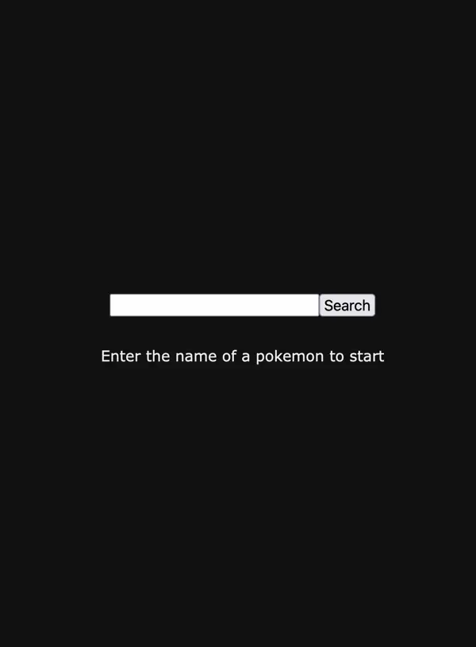

# TypeScript Example App



A single page (and file) React application written in TypeScript.

Utilizes the [pokeapi](https://pokeapi.co/) service.

To run this application, please ensure you have node v20+ installed. If you do not have yarn, install it via

```bash
npm i -g yarn
```

Then run the following

```bash
yarn install
yarn start
```
